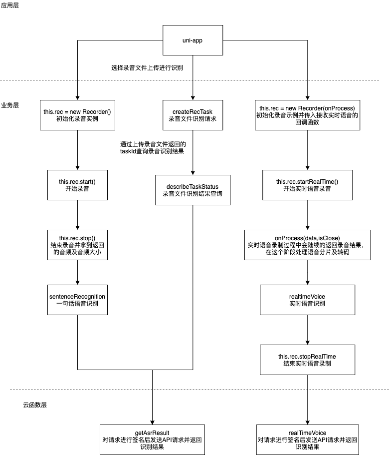

# 腾讯云语音识别（ASR）插件

## 1. 插件介绍

| 标题        | 名称                                                                                                      |
| ----------- | --------------------------------------------------------------------------------------------------------- |
| 中文名称    | 腾讯云语音识别（ASR）插件                                                                                 |
| 英文名称    | tencentcloud-plugin-asr                                                                                   |
| 最新版本    | v1.0.2 (2020.11.05)                                                                                       |
| 适用平台    | [DCloud uni-app](https://uniapp.dcloud.net.cn)                                                            |
| 适用产品    | [腾讯云语音识别（ASR）插件](https://cloud.tencent.com/product/asr)                                        |
| GitHub 项目 | [tencentcloud-uniapp-plugin-asr](https://github.com/Tencent-Cloud-Plugins/tencentcloud-uniapp-plugin-asr) |
| 主创团队    | 腾讯云中小企业产品中心（SMB Product Center of Tencent Cloud）                                             |
| 兼容平台   | H5、小程序、APP |

一款帮助开发者在 uni-app 项目开发中快捷使用腾讯云语音识别（ASR）插件产品功能的插件。

## 2. 功能特性

- 一句话语音识别
- 录音文件识别(仅支持H5)
- 实时语音识别(支持H5和小程序）

## 3. 安装指引

本插件需要调用 uniCloud 云函数，而使用云函数的前提是：

- 使用 DCloud 官方开发工具 HBuilderX 2.7+；
- 已注册 DCloud 开发者账号并通过实名认证；
- 开通了 uniCloud 并创建一个腾讯云的服务空间；

### 3.1. 新建或打开已有项目

1. 打开 HBuilderX 开发工具；
1. 新建或打开一个 uni-app 项目；

### 3.2. 导入云函数

1. 访问 DCloud 插件市场的 [腾讯云插件 - 云函数模板](https://ext.dcloud.net.cn/plugin?id=2139) 详情页；
2. 点击详情页右上角 **使用 HBuilderX 导入插件**，将云函数模板导入到您的项目中；

3. 在项目中打开 _cloudfunctions/tencentcloud-plugin/config.js_ 文件，将腾讯云的密钥信息配置进去，可以在腾讯云 [API 密钥管理](https://console.cloud.tencent.com/cam/capi) 中获取 SecretId、SecretKey 和 APPID；

4. 在[uniCloud控制台](https://unicloud.dcloud.net.cn/login)注册HBuild账号并登录，创建[云服务空间](https://uniapp.dcloud.net.cn/uniCloud/concepts/space)；

5. 绑定云函数的云服务空间，将[云函数](https://uniapp.dcloud.net.cn/uniCloud/concepts/cloudfunction) [**上传部署**](https://uniapp.dcloud.net.cn/uniCloud/quickstart?id=rundebug) 到您的[云服务空间](https://uniapp.dcloud.net.cn/uniCloud/concepts/space)；


> 如果您之前在使用其它腾讯云产品的 uni-app 插件时已经导入过此云函数模板，则前 4 个步骤可以省略。

> 若导入失败或有其它疑问，请查看 [uniCloud 帮助文档](https://uniapp.dcloud.io/uniCloud/README) 云函数相关章节。

### 3.3. 导入插件

1. 访问 DCloud 插件市场 [腾讯云语音识别（ASR）插件](https://ext.dcloud.net.cn/plugin?id=2517) 详情页；
1. 点击详情页右上角 **使用 HBuilderX 导入插件** ，将插件导入到您的项目中；
1. 在项目中通过 import 语法将插件提供的方法导入到相关业务组件并使用；

> 本插件的默认导入位置是在您项目的“js_sdk”目录下

## 4. 使用指引

### 4.1. 插件 API 导图



### 4.2. 插件使用示例

```javascript
// 一句话语音识别示例代码
import {
  sentenceRecognition,
  toBase64,
  Recorder,
} from "@/js_sdk/tencentcloud-plugin-asr";

methods: {
    onLoad: function () {
      // 初始化录音实例
      this.rec = new Recorder();
    },
    // 开始录音
    async startRecord() {
      try {
        this.status = true;
        await this.rec.start();
      } catch (e) {
        throw new Error(e);
      }
    },
    // 停止录音
    async endRecord() {
      this.status = false;
      try {
        // 录音完成获取录音文件和音频大小
        const { voiceBase64, size } = await this.rec.stop();
        uni.showLoading({
          mask: true,
        });
        // 发起一句话识别请求
        const { result } = await sentenceRecognition({
          engSerViceType: "8k_zh",
          sourceType: 1,
          voiceFormat: "mp3",
          usrAudioKey: "test",
          dataLen: size,
          data: voiceBase64,
        });
        this.resultText = result.Result;
      } catch (error) {
        throw new Error(error);
      } finally {
        uni.hideLoading();
      }
    },
  },
};
```

```javascript
// 录音文件识别
import {
  createRecTask,
  describeTaskStatus,
  blob2Base64,
} from "@/js_sdk/tencentcloud-plugin-asr";

export default {
  data() {
    return {
      inputEl: "",
      taskId: null,
      resultText: "", // 语音识别结果
    };
  },
  methods: {
    // 文件转码上传
    async uploadFile() {
      try {
        const event = await this.chooseFile();
        // 文件转换为base64编码
        const fileBase64 = await blob2Base64(event.target.files[0]);
        this.sendRecord(fileBase64, event.target.files[0].size);
      } catch (error) {
        throw new Error(error);
      }
    },
    // 选择录音文件
    chooseFile() {
      return new Promise((resolve, reject) => {
        if (!this.inputEl) {
          this.inputEl = document.createElement("input");
          this.inputEl.type = "file";
          this.$refs.input.$el.appendChild(this.inputEl);
        }
        this.inputEl.onchange = (event) => {
          resolve(event);
        };
        this.inputEl.click();
      });
    },
    // 录音文件识别请求
    async sendRecord(file, size) {
      try {
        uni.showLoading({
          mask: true,
        });
        const { result } = await createRecTask({
          engineModelType: "8k_zh",
          channelNum: 1,
          resTextFormat: 0,
          sourceType: 1,
          data: (/.+;\s*base64\s*,\s*(.+)$/i.exec(file) || [])[1],
          dataLen: size,
        });
        this.taskId = result.Data.TaskId;
      } catch (error) {
        throw new Error(error);
      } finally {
        uni.hideLoading();
      }
    },
    // 录音文件识别结果查询
    async getResult() {
      try {
        uni.showLoading({
          mask: true,
        });
        const { result } = await describeTaskStatus(this.taskId);
        this.resultText =
          result.Data.StatusStr === "waiting" ||
          result.Data.StatusStr === "doing"
            ? "正在解析中，请稍后再试"
            : result.Data.Result;
      } catch (error) {
        throw new Error(error);
      } finally {
        uni.hideLoading();
      }
    },
  },
};
```

```javascript
// 实时语音识别
import {
  realtimeVoice,
  randStr,
  Recorder,
  blob2Base64,
  RealTimeVoiceSplit,
} from "@/js_sdk/tencentcloud-plugin-asr";

export default {
  data() {
    return {
      resultText: "", // 语音识别结果
      status: false, // 录音状态
      voice_id: "", // 识别音频的唯一id
      recorder: null, // 录音实例
      realTimeVoice: null, // 录音分片实例
    };
  },
  methods: {
    onUnload() {
      // 离开页面时卸载掉正在进行的录音行为
      this.recorder && this.recorder.stopRealTime();
    },
    /**
     * 实时语音录音回调
     * @param {string} data 实时音频的返回结果
     * @param {boolean} isClose 是否为录音的最后一段
     */
    async onProcess(data, isClose) {
      // #ifdef H5
      // data: 分片后Base64编码的音频 seq: 当前第几个录音分片，初始为1
      const {
        data: voiceBase64,
        seq,
      } = await this.realTimeVoice.realTimeSendTryH5(this.recorder.rec);
      // #endif
      // #ifndef H5
      // data: 分片后Base64编码的音频 seq: 当前第几个录音分片，初始为1
      const {
        data: voiceBase64,
        seq,
      } = await this.realTimeVoice.realTimeSendTryMP(data);
      // #endif
      // 实时语音参数
      let params = {
        engine_model_type: "16k_zh",
        seq: seq - 1,
        end: isClose ? 1 : 0,
        voice_id: this.voice_id,
        res_type: 0,
        voice_format: 8,
      };
      // 调用实时语音识别的jssdk
      const { result } = await realtimeVoice(voiceBase64, params);
      // 语音识别的文本结果
      this.resultText = result.text;
    },
    // 开始录音
    async startRecord() {
      try {
        // 初始化录音和回调实例
        this.voice_id = randStr(16);
        // 实时语音需要在初始化Recorder时传入回调函数接收语音的回调
        this.recorder = new Recorder(this.onProcess);
        // 初始化语音分片类，H5平台可以传入参数设定语音分片的间隔
        this.realTimeVoice = new RealTimeVoiceSplit();
        this.status = true;
        await this.recorder.startRealTime();
      } catch (e) {
        throw new Error(e);
      }
    },
    // 停止录音
    async endRecord() {
      this.status = false;
      // 停止语音录制
      this.recorder.stopRealTime();
    },
  },
};
```

### 4.3 主要 API 说明

#### realtimeVoice(data, params) ⇒ <code>Promise.&lt;object&gt;</code>

实时语音识别

**Kind**: global function  
**Returns**: <code>Promise.&lt;object&gt;</code> - result 语音识别结果

| Param                       | Type                 | Description                                                                                                                                                                                         |
| --------------------------- | -------------------- | --------------------------------------------------------------------------------------------------------------------------------------------------------------------------------------------------- |
| data                        | <code>object</code>  | // base64 编码的 voice 文件                                                                                                                                                                         |
| params                      | <code>object</code>  | // 参数                                                                                                                                                                                             |
| params.engine_model_type    | <code>string</code>  | 引擎模型类型。8k_zh：电话 8k 中文普通话通用；8k_zh_finance：电话 8k 金融领域模型；16k_zh：16k 中文普通话通用；16k_en：16k 英语；16k_ca：16k 粤语；16k_ko：16k 韩语；16k_zh-TW：16k 中文普通话繁体。 |
| params.seq                  | <code>integer</code> | 语音分片的序号，序号从 0 开始，每次请求递增 1， 两个 seq 之间间隔不能超过 6 秒。                                                                                                                    |
| params.end                  | <code>integer</code> | 是否为最后一片，最后一片语音片为 1，其余为 0。                                                                                                                                                      |
| params.voice_id             | <code>string</code>  | 16 位 String 串作为每个音频的唯一标识，用户自己生成。                                                                                                                                               |
| [params.hotword_id]         | <code>string</code>  | 热词 id。用于调用对应的热词表，如果在调用语音识别服务时，不进行单独的热词 id 设置，自动生效默认热词；如果进行了单独的热词 id 设置，那么将生效单独设置的热词 id。                                    |
| [params.result_text_format] | <code>integer</code> | 识别结果文本编码方式。0：UTF-8；1：GB2312；2：GBK；3：BIG5。                                                                                                                                        |
| [params.res_type]           | <code>integer</code> | 结果返回方式。 0：同步返回；1：尾包返回。                                                                                                                                                           |
| [params.voice_format]       | <code>integer</code> | 语音编码方式，可选，默认值为 4。1：wav(pcm)；4：speex(sp)；6：silk；8：mp3；10：opus（opus 格式音频流封装说明）。                                                                                   |
| [params.needvad]            | <code>integer</code> | 0：关闭 vad，1：开启 vad。如果音频流总时长超过 60 秒，用户需开启 vad。                                                                                                                              |
| [params.vad_silence_time]   | <code>integer</code> | 语音断句检测阈值，静音时长超过该阈值会被认为断句（多用在智能客服场景，需配合 needvad=1 使用），取值范围 150-2000，单位 ms，目前仅支持 8k_zh 引擎模型。                                              |
| [params.source]             | <code>int</code>     | 默认值为 0。                                                                                                                                                                                        |
| [params.filter_dirty]       | <code>integer</code> | 是否过滤脏词（目前支持中文普通话引擎）。默认为 0。0：不过滤脏词；1：过滤脏词；2：将脏词替换为 \* 。                                                                                                 |
| [params.filter_modal]       | <code>integer</code> | 是否过滤语气词（目前支持中文普通话引擎）。默认为 0。0：不过滤语气词；1：部分过滤；2：严格过滤 。                                                                                                    |
| [params.filter_punc]        | <code>integer</code> | 是否过滤句末的句号（目前支持中文普通话引擎）。默认为 0。0：不过滤句末的句号；1：过滤句末的句号。                                                                                                    |
| [params.convert_num_mode]   | <code>integer</code> | 是否进行阿拉伯数字智能转换。0：全部转为中文数字；1：根据场景智能转换为阿拉伯数字。                                                                                                                  |
| [params.word_info]          | <code>integer</code> | 是否显示词级别时间戳。0：不显示；1：显示。支持引擎：8k_zh, 8k_zh_finance, 16k_zh, 16k_en, 16k_ca，默认为 0。                                                                                        |

#### createRecTask(params) ⇒ <code>Promise.&lt;object&gt;</code>

录音文件识别请求

**Kind**: global function  
**Returns**: <code>Promise.&lt;object&gt;</code> - result 录音上传结果

| Param                       | Type                 | Description                                                                                                                                                                                                                                                                   |
| --------------------------- | -------------------- | ----------------------------------------------------------------------------------------------------------------------------------------------------------------------------------------------------------------------------------------------------------------------------- |
| params                      | <code>object</code>  |                                                                                                                                                                                                                                                                               |
| params.engineModelType      | <code>string</code>  | 引擎模型类型。 电话场景： • 8k_zh：电话 8k 中文普通话通用（可用于双声道音频）； • 8k_zh_s：电话 8k 中文普通话话者分离（仅适用于单声道音频）； 非电话场景： • 16k_zh：16k 中文普通话通用； • 16k_zh_video：16k 音视频领域； • 16k_en：16k 英语； • 16k_ca：16k 粤语；          |
| params.channelNum           | <code>integer</code> | 语音声道数。1：单声道；2：双声道（仅支持 8k_zh 引擎模型）。                                                                                                                                                                                                                   |
| params.resTextFormat        | <code>integer</code> | 识别结果返回形式。0： 识别结果文本(含分段时间戳)； 1：仅支持 16k 中文引擎，含识别结果详情(词时间戳列表，一般用于生成字幕场景)。                                                                                                                                               |
| params.sourceType           | <code>integer</code> | 语音数据来源。0：语音 URL；1：语音数据（post body）。                                                                                                                                                                                                                         |
| [params.callbackUrl]        | <code>string</code>  | 回调 URL，用户自行搭建的用于接收识别结果的服务器地址， 长度小于 2048 字节。如果用户使用回调方式获取识别结果，需提交该参数；如果用户使用轮询方式获取识别结果，则无需提交该参数。                                                                                               |
| [params.url]                | <code>string</code>  | 语音 URL，公网可下载。当 SourceType 值为 0（语音 URL 上传） 时须填写该字段，为 1 时不填；URL 的长度大于 0，小于 2048，需进行 urlencode 编码。音频时间长度要小于 60s。                                                                                                         |
| [params.data]               | <code>string</code>  | 语音数据，当 SourceType 值为 1（本地语音数据上传）时必须填写，当 SourceType 值为 0（语音 URL 上传）可不写。要使用 base64 编码(采用 python 语言时注意读取文件应该为 string 而不是 byte，以 byte 格式读取后要 decode()。编码后的数据不可带有回车换行符)。音频数据要小于 600KB。 |
| [params.dataLen]            | <code>integer</code> | 数据长度，单位为字节。当 SourceType 值为 1（本地语音数据上传）时必须填写，当 SourceType 值为 0（语音 URL 上传）可不写（此数据长度为数据未进行 base64 编码时的数据长度）。                                                                                                     |
| [params.hotwordId]          | <code>string</code>  | 热词 id。用于调用对应的热词表，如果在调用语音识别服务时，不进行单独的热词 id 设置，自动生效默认热词；如果进行了单独的热词 id 设置，那么将生效单独设置的热词 id                                                                                                                |
| [params.filterDirty]        | <code>integer</code> | 是否过滤脏词（目前支持中文普通话引擎）。0：不过滤脏词；1：过滤脏词；2：将脏词替换为 \*                                                                                                                                                                                        |
| [params.filterModal]        | <code>integer</code> | 是否过语气词（目前支持中文普通话引擎）。0：不过滤语气词；1：部分过滤；2：严格过滤 。默认值为 0。                                                                                                                                                                              |
| [params.convertNumMode]     | <code>integer</code> | 是否进行阿拉伯数字智能转换。0：不转换，直接输出中文数字，1：根据场景智能转换为阿拉伯数字。默认值为 1                                                                                                                                                                          |
| [params.extra]              | <code>string</code>  | 附加参数                                                                                                                                                                                                                                                                      |
| [params.speakerDiarization] | <code>integer</code> | 是否开启话者分离，0：不开启，1：开启(仅支持 8k_zh/16k_zh 引擎模型，单声道音频)                                                                                                                                                                                                |
| [params.speakerNumber]      | <code>integer</code> | 话者分离人数（需配合开启话者分离使用），支持 2-10（8k_zh 仅支持 2， 16k_zh 支持 2-10）注：话者分离目前是 beta 版本，请根据您的需要谨慎使用                                                                                                                                    |

#### describeTaskStatus(taskId) ⇒ <code>Promise.&lt;object&gt;</code>

录音文件识别结果查询

**Kind**: global function  
**Returns**: <code>Promise.&lt;object&gt;</code> - result 录音识别结果

| Param  | Type                 | Description             |
| ------ | -------------------- | ----------------------- |
| taskId | <code>integer</code> | 录音上传后返回的 TaskID |

#### sentenceRecognition(params) ⇒ <code>Promise.&lt;object&gt;</code>

一句话识别 api

**Kind**: global function  
**Returns**: <code>Promise.&lt;object&gt;</code> - result 音频识别结果

| Param                   | Type                 | Description                                                                                                                                                                                                                                                                   |
| ----------------------- | -------------------- | ----------------------------------------------------------------------------------------------------------------------------------------------------------------------------------------------------------------------------------------------------------------------------- |
| params                  | <code>object</code>  |                                                                                                                                                                                                                                                                               |
| params.engSerViceType   | <code>string</code>  | 引擎模型类型。 8k_zh：电话 8k 中文普通话通用；16k_zh：16k 中文普通话通用；16k_en：16k 英语；16k_ca：16k 粤语。                                                                                                                                                                |
| params.sourceType       | <code>integer</code> | 语音数据来源。0：语音 URL；1：语音数据（post body）。                                                                                                                                                                                                                         |
| params.voiceFormat      | <code>string</code>  | 识别音频的音频格式。mp3、wav。                                                                                                                                                                                                                                                |
| params.usrAudioKey      | <code>string</code>  | 用户端对此任务的唯一标识，用户自助生成，用于用户查找识别结果。                                                                                                                                                                                                                |
| [params.url]            | <code>string</code>  | 语音 URL，公网可下载。当 SourceType 值为 0（语音 URL 上传） 时须填写该字段，为 1 时不填；URL 的长度大于 0，小于 2048，需进行 urlencode 编码。音频时间长度要小于 60s。                                                                                                         |
| [params.data]           | <code>string</code>  | 语音数据，当 SourceType 值为 1（本地语音数据上传）时必须填写，当 SourceType 值为 0（语音 URL 上传）可不写。要使用 base64 编码(采用 python 语言时注意读取文件应该为 string 而不是 byte，以 byte 格式读取后要 decode()。编码后的数据不可带有回车换行符)。音频数据要小于 600KB。 |
| [params.dataLen]        | <code>integer</code> | 数据长度，单位为字节。当 SourceType 值为 1（本地语音数据上传）时必须填写，当 SourceType 值为 0（语音 URL 上传）可不写（此数据长度为数据未进行 base64 编码时的数据长度）。                                                                                                     |
| [params.hotwordId]      | <code>string</code>  | 热词 id。用于调用对应的热词表，如果在调用语音识别服务时，不进行单独的热词 id 设置，自动生效默认热词；如果进行了单独的热词 id 设置，那么将生效单独设置的热词 id                                                                                                                |
| [params.filterDirty]    | <code>integer</code> | 是否过滤脏词（目前支持中文普通话引擎）。0：不过滤脏词；1：过滤脏词；2：将脏词替换为 \*                                                                                                                                                                                        |
| [params.filterModal]    | <code>integer</code> | 是否过语气词（目前支持中文普通话引擎）。0：不过滤语气词；1：部分过滤；2：严格过滤 。                                                                                                                                                                                          |
| [params.filterPunc]     | <code>integer</code> | 是否过滤句末的句号（目前支持中文普通话引擎）。0：不过滤句末的句号；1：过滤句末的句号。                                                                                                                                                                                        |
| [params.convertNumMode] | <code>integer</code> | 是否进行阿拉伯数字智能转换。0：不转换，直接输出中文数字，1：根据场景智能转换为阿拉伯数字。默认值为 1                                                                                                                                                                          |

### 4.4. 名词解释

服务空间：一个服务空间对应一整套独立的云开发资源，包括数据库、存储空间、云函数等资源。服务空间之间彼此隔离。更多详情请访问 [uniCloud 开发文档](https://uniapp.dcloud.io/uniCloud/concepts/space)

云函数：云函数是运行在云端的 JavaScript 代码，更多详情请见 [uniCloud 云函数文档](https://uniapp.dcloud.io/uniCloud/cf-functions)

## 5. 获取入口

| 插件入口        | 链接 |
| --------------- | ---- |
| DCloud 插件市场 |   [腾讯云语音识别（ASR）插件](https://ext.dcloud.net.cn/plugin?id=2517)   |

## 6. FAQ
> 1. Q:实时语音识别功能支持APP端吗？
>    
>    A：目前实时语音识别只支持H5和小程序端，暂不支持APP端

## 7. GitHub 版本迭代记录

### 7.1. tencentcloud-uniapp-plugin-asr v1.0.2

- 新增一句话语音识别功能支持APP端

### 7.2. tencentcloud-uniapp-plugin-asr v1.0.1

- 目录结构优化

### 7.3. tencentcloud-uniapp-plugin-asr v1.0.0

- 新增一句话语音识别功能
- 新增录音文件识别功能
- 新增实时语音识别功能

## 8. 致谢

- 该插件的 H5 平台语音录制功能参考了[Recorder](https://github.com/xiangyuecn/Recorder),特此对其主创团队进行致谢

## 9. 联系我们

&nbsp;&nbsp;&nbsp;扫码备注“春雨”来联络到我们</br>

